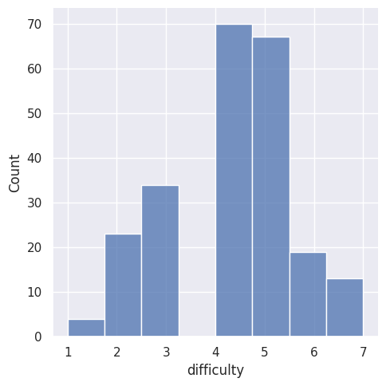
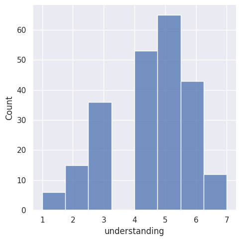
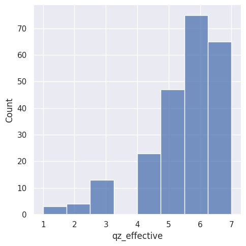
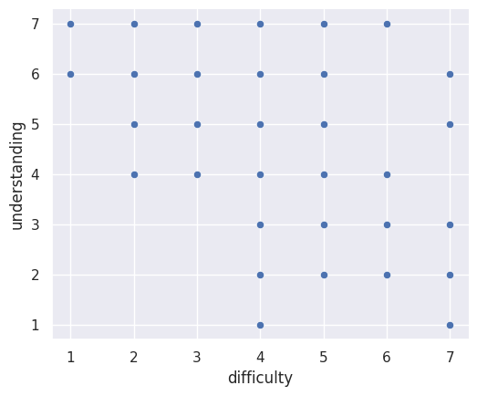
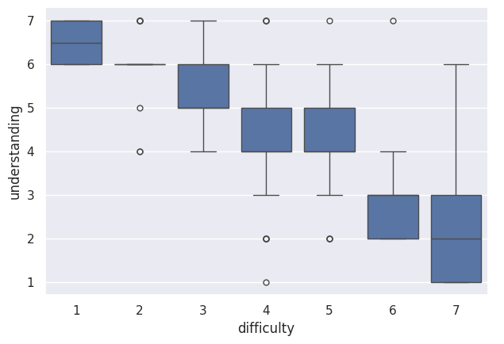

---
# Do not edit the text between these lines!
layout: default
---

# EX09: Data Analysis for Continuous Improvement

<!-- This is a comment. Below, you'll see code for inserting an image. To make this image appear, update <custom-path>. To add an image, save it inside the imgs folder of this repository. -->
/static/imgs/logo.png" alt="Image of Comp110 rainbow logo. "  width="500"/>

## Proposal (Idea)

My suggested course improvement is to provide a longer (or additional) structured review session before each quiz. The goal is to better support students who report high course difficulty and lower understanding, by giving them targeted guided practice and a clear checklist of concepts before the quiz.

## Data

This analysis uses anonymized COMP110 survey data (survey_alyssa.csv). Each row represents one student response. I focused on three Likert-scale columns:

difficulty (reported course difficulty)
understanding (reported course understanding)
qz_effective (how effective quizzes feel)
To prepare the dataset for plotting, I loaded the CSV into row dictionaries, transformed it into column-based format, and converted the relevant columns to integers before creating a Pandas DataFrame for Seaborn.

## Methods

1.Distribution analysis: I used Seaborn displot to visualize the distribution of difficulty, understanding, and qz_effective to see overall patterns and where responses concentrate.
2.Relationship analysis: I used a Seaborn scatterplot (relplot) to examine the relationship between difficulty and understanding.
3.Group comparison: I used a Seaborn box plot (catplot(kind="box")) to compare typical understanding levels across difficulty ratings (1–7).

## Results

## Figure 1. Distribution of reported course difficulty

Most difficulty ratings fall in the mid-to-high range (around 4–6), suggesting many students experience COMP110 as moderately to highly challenging rather than “easy.”

## Figure 2. Distribution of reported course understanding

Understanding ratings cluster around the mid-to-high range, but there is still spread downward. This indicates that while many students feel they understand the course reasonably well, a noticeable subgroup reports lower understanding.

## Figure 3. Distribution of perceived quiz effectiveness

Quiz effectiveness responses are concentrated around 5–7. This suggests quizzes generally feel helpful for many students, but this does not automatically mean they work equally well for students who feel the course is difficult.

## Figure 4. Difficulty vs. understanding (scatterplot)

The scatterplot suggests a negative relationship between course difficulty and reported understanding: higher difficulty ratings (especially 6–7) include many lower understanding values. This pattern is consistent with the idea that students who feel the course is harder are more likely to still feel confused.

## Figure 5. Understanding by difficulty rating (box plot)

The box plot makes the same pattern easier to interpret: the median understanding decreases as difficulty increases, and the lowest typical understanding occurs at difficulty level 7. This supports the interpretation that increased difficulty is associated with decreased understanding.

## Conclusion + Recommendation

Overall, my findings support the idea that increased pre-quiz review time could help students who report higher difficulty and lower understanding.

Recommendation: offer a longer (or additional) review session before each quiz, with:

the most common sticking points from practice problems,
a few representative problems worked step-by-step, and
a short checklist of concepts the quiz will draw on.
To serve students with different backgrounds, the session could be structured as a quick fundamentals recap plus an optional deeper challenge segment.

## Limitations/Trade-offs
This is self-reported survey data (difficulty and understanding are subjective).
The analysis shows association, not proof that difficulty causes low understanding.
Longer review sessions have real costs: more instructor/TA time and potential reduction of time for new content, office hours, or other support.
Students with tight schedules may not be able to attend longer sessions; providing a structured handout or recorded walkthrough could reduce this downside.

## Link
Live site: https://zhenx420.github.io/github.io-zx-path/

